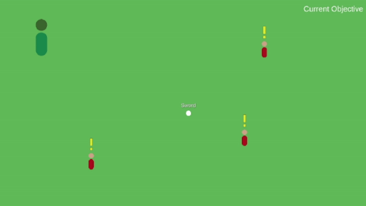

# Procedural Quest system based on GOAP

## Introduction

GOAP or Goal Oriented Action planning is a decision structure used to control agents in games. 
GOAP allows agents to dynammically create a plan to move towards a certain goal. The actions used to reach that goal are not fixed in the structure, but can be arranged many different ways. The game originally implenting this method is F.E.A.R.. 

This project has the aim to see if the GOAP decision structure can be used to procedurally create quests.

## Goal Oriented Action Planning

In order to create a GOAP structure, a few concepts within the system need to be explained. 

These concepts are:
+ Planner
+ Actions
+ Preconditions and Effects
+ Goals
+ Agent

### Planner

The planner is tasked with generating the series of actions an agent needs to execute. The agent will pick the goal that has the highest priority and then the planner starts by using the **preconditions** of the goal to find the action with the right **effects**. If the action also has preconditions of it's own, the planner will try to find another action with the desired effect. This cycle will continue until an action is found that satisfies the previous without having preconditions that aren't met. If no valid action is left, then the goal cannot be completed.

### Actions

An action is something that can be completed by the agent. This can range from picking up an item to moving around and everything in between. 
Actions have a cost associated with them, this way the planner can decide which set of actions to pick if there are multiple ways to reach the goal.

### Preconditions and Effects

A *precondition* is a world state that needs to be met before the action or goal can be completed. The *effect* is the change the action will make to the world state.

### Goals

Each series of actions starts with a goal in mind. This can be opening a door or searching for the player around the map. 
The planner needs a goal as a starting point to start generating the actions necessary to complete it.

In this project, the goal is the equivalent of a quest.

### Agent

The agent has a series of goals it needs to complete, with each goal having a priority. The agent will request a series of actions to follow from the planner based on the goal with the highest priority. The main difference from normal GOAP is that the agent is not controlled by the game, but is the player of said game. 

## Demo
### Context

In this demo, a few types of goals, actions and worldstates are used:

Actions:
+ RetrieveSword
+ AttackMonster

Goals:
+ GetSword
+ DefeatMonster

WorldStates
+ HasSword
+ SwordAvailable
+ HasDefeatedMonster

### GOAP in action

First time we do the quest as intended, accepting the quest from the npc and then defeating the monster. 

Second time, we do the quest out of order. First we pick up the sword and then we go to the npc to accept the quest to defeat the monster

## Advantages and Disadvantages

### Advantages
+ Quests can be created dynamically. That means that if the player already did something the quest requires, the quest will automatically skip it without there being the need for additional code
+ It is very easy to add new actions, goals and worldstates and maintain the existing ones.

### Disadvantages
- Plans need to be recalculated often, which may cause performance issues.
- Plans may have unintended side effects if a large amount of actions exists. This can be an action putting the world in a state it cannot get out of again for example. 

## Conclusion

In conclusion, GOAP can be used to generate quests procedurally. It can be stated that GOAP does not just create AI for agents controlled by the game, but it can also create an AI players have to listen to.

### Further Research

This project only contained simple actions and goals in a 2D point & click style game. 
So the next step should involve making the actions and goals more complex. Perhaps even increasing the scope to a 3D environment.

## Sources and Interesting links:

https://gamedevelopment.tutsplus.com/tutorials/goal-oriented-action-planning-for-a-smarter-ai--cms-20793
https://www.youtube.com/watch?v=LhnlNKWh7oc

https://github.com/viniciusgerevini/godot-goap
https://www.youtube.com/watch?v=PaOLBOuyswI&t=578s

